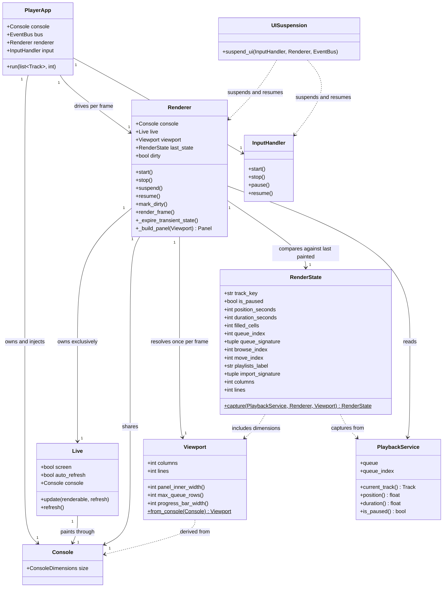

# Eliminate Player TUI Flicker When Terminal Is Unfocused or Backgrounded

## Requirements

Eliminate visible flicker in the interactive player TUI by replacing unconditional, time-driven, inline repainting with conditional, change-driven painting on a stable, exclusively-owned terminal viewport.

- **Problem**: the now-playing panel visibly flickers during playback, pronounced when the terminal window is unfocused or backgrounded, making the player unpleasant to leave running — its primary use case.
- **Value**: the player is a background-resident tool for DJs; a stable display is a precondition for leaving it open during a set or a work session.
- **Scope**: `musikbox/cli/player/` only — the interactive `PlayerApp` session and the three modal overlays it suspends itself for (`browser`, `editor`, `importer`).
- **Out of scope**: any change to `domain/`, `services/`, `adapters/`, playback behaviour, the event vocabulary in `events/types.py`, the one-shot table renderers in `cli/play.py`, or migration to a different TUI framework.
- **Constraint**: no new runtime dependency. Rich 14.3.3 is installed and its documented `Live` options (`console`, `screen`, `auto_refresh`, `refresh_per_second`, `vertical_overflow`) are sufficient.

## Entities

**Conservative notes on the model above:**

- `Track`, `TrackId`, `PlaybackService`, `EventBus`, and every event type in `events/types.py` are **unchanged**. No new events, no new domain types, no repository or service changes.
- `Viewport` and `RenderState` are new **frozen dataclasses** in the CLI layer. They are plain value objects, not domain models, and carry no behaviour beyond derivation and comparison. They exist because the analysis identified "no single authoritative viewport" and "no notion of an unchanged frame" as the two structural gaps behind the defect.
- `Renderer` keeps its existing public surface (`start`, `stop`, `pause`, `resume`, `_build_panel`) so `test_renderer.py` and the three modal call sites keep working. `pause`/`resume` are retained as aliases delegating to `suspend`/`resume`.
- The four existing module-level `Console()` objects stay in place as defaults; injection is additive and backward compatible.

## Approach

### 1. Display ownership — own the screen, paint once, paint whole

- Construct the player's `Live` with `screen=True` so the panel lives on the alternate screen buffer for the session's lifetime. Inline mode repaints by moving the cursor up N lines and erasing them; when N varies between frames — which it currently does, because queue-row count is derived from a possibly-fallback terminal height — the terminal shows a collapse-and-regrow that reads exactly as flicker. On the alternate screen the repaint is a bounded, in-place overwrite of a fixed region.
- With `screen=True`, `transient=True` becomes redundant (leaving the alternate screen restores the prior display) and is removed.
- Set `vertical_overflow="crop"` rather than the default `"ellipsis"`: on the alternate screen, cropping is stable, whereas ellipsis rendering changes the trailing-line composition when content is near the height boundary.
- Alternate-screen teardown becomes a correctness requirement, not a nicety: a process that dies without restoring the primary buffer leaves the user's terminal broken — strictly worse than the flicker being fixed. Register teardown on `atexit` alongside the existing termios restoration, and keep the explicit teardown in `PlayerApp.run`'s `finally` block.

### 2. Refresh authority — one clock, one painter

- Disable Rich's auto-refresh thread (`auto_refresh=False`). Today two uncoordinated painters run at the same nominal 4 Hz — Rich's background thread and the main loop's `Tick` handler calling `Live.update()` — and their phases drift, producing roughly two repaints per cycle at arbitrary offsets.
- Invert the renderer's control flow: **event handlers mutate state and set a dirty flag; they never paint.** The main loop calls `Renderer.render_frame()` exactly once per iteration, and that is the only place `Live.update(..., refresh=True)` is ever called.
- This makes the frame boundary deterministic and gives event coalescing for free: an import burst emitting many `ImportTrackDownloaded` events between two frames collapses to a single paint.
- Cap the frame rate inside `render_frame()` at 4 Hz (a 0.25s minimum interval) using `time.monotonic()`. The nominal rate is not the problem and must not be lowered — lowering it would hide the symptom rather than remove the cause.

### 3. Change detection — paint only what differs

- Capture a `RenderState` fingerprint at each frame boundary and compare it to the last painted one. Identical fingerprint → no build, no paint. A paused player with no input then paints zero frames per second.
- The fingerprint must include **everything** that reaches `_build_panel()`, including the cached playlist-membership label and the import banner fields; an omitted field means a real update is silently swallowed. This is the primary risk of the whole change and is what the tests must pin down.
- Quantise time-derived values to the granularity the UI can actually display: whole seconds for the timestamps, and the **filled-cell count** for the progress bar. Sub-second position deltas that cannot change a single rendered glyph must not mark the frame dirty.
- Include the viewport dimensions in the fingerprint so a genuine terminal resize — including one that happened while backgrounded and is first observed on refocus — repaints exactly once.

### 4. Geometry — one measurement per frame

- Replace all three `shutil.get_terminal_size()` calls inside `_build_panel()` with a single `Viewport` resolved once per frame from `Console.size` — the same console Rich paints through. Independent measurements can disagree *within* one frame (a progress bar sized for 200 columns beside queue rows sized for 80) and *between* adjacent frames.
- `Viewport` owns all derived geometry (`panel_inner_width`, `max_queue_rows`, `progress_bar_width`) with defensive floors, so the negative-multiplier bug at `renderer.py:333` (`"─" * (columns - 4)` with no floor) is structurally impossible rather than merely avoided.
- Pass the `Viewport` into `_build_panel()` as a parameter. This makes the builder a pure function of (service state, renderer state, viewport) — which is what makes the line-count-stability invariant testable at all.

### 5. Console ownership and terminal exclusivity

- `PlayerApp` creates one `Console` and injects it into `Renderer` and into the three modal components. Four independent `Console` objects each cache size and state separately, which defeats the single-source-of-geometry decision.
- Injection is additive: each component gains an optional `console` parameter defaulting to its existing module-level instance, so nothing outside `PlayerApp` changes behaviour.
- Replace the three duplicated pause/resume sequences (`browser.py:133`, `editor.py:151`, `importer.py:84`) with one `suspend_ui` context manager enforcing a single ordering: suspend renderer → pause input → (modal runs) → resume input → resume renderer → request refresh. Two threads touch the tty; under alternate-screen the ordering of mode switches versus screen switches becomes load-bearing.
- Fix the latent `Renderer.resume()` bug: it currently calls `Live.start()` on the `Live` object that `pause()` stopped. Restarting a stopped `Live` in place is not a supported lifecycle. `resume()` must construct a **fresh** `Live` and force a repaint by clearing the last-painted fingerprint.

### 6. Transient state expiry

- The import banner's 10-second auto-dismiss currently mutates renderer state *inside* `_build_panel()`. Under change-driven painting, a frame that decides not to build would never expire the banner — and since the banner's presence is part of the fingerprint, the panel would freeze with a stale banner forever.
- Move expiry into `_expire_transient_state()`, called at the top of `render_frame()` **before** the fingerprint is captured, so expiry itself makes the frame dirty.

### 7. Signal and lifecycle handling

- Handle `SIGTSTP`/`SIGCONT` (Ctrl-Z then `fg`): leave the alternate screen and restore terminal mode before suspending; re-enter and force a full repaint on resume. There is currently no such handling anywhere in the player.
- Detect non-tty stdout explicitly and degrade to a documented no-op display rather than relying on incidental `Live` behaviour.

### 8. Verification strategy

- The defect is environment-dependent and its final confirmation is visual, which sits awkwardly with the repo's TDD convention. Resolve this by testing the **invariants** rather than the appearance: one paint per frame, zero paints when state is unchanged, exactly one geometry resolution per frame, stable line count for fixed state and dimensions, repaint on genuine resize.
- Treat visual confirmation as a separate, explicitly-stated manual acceptance step with a named terminal emulator and a fixed observation window.
- Follow the repo convention: **write the tests first**, co-located as `test_<module>.py`.

## Structure

### Inheritance Relationships

1. `Viewport` is a `@dataclass(frozen=True)` value object — no inheritance, no ABC. It is a CLI-layer helper, not a domain port.
2. `RenderState` is a `@dataclass(frozen=True)` value object relying on generated `__eq__` for fingerprint comparison.
3. `Renderer` remains a plain class with no base class, as today.
4. No new exception types. This change introduces no failure mode that a caller can meaningfully handle; terminal-restoration failures are handled in place, not raised.
5. No new port ABCs. Per the analysis, the player layer deliberately has no rendering port — the CLI owns Rich output directly, and introducing a port here would be an architecture change rather than a defect fix.

### Dependencies

1. `PlayerApp` constructs `Console` and injects it into `Renderer`, `Editor`, `LibraryBrowser`, and `Importer`.
2. `PlayerApp.run` calls `Renderer.render_frame()` once per main-loop iteration — the sole paint trigger.
3. `Renderer` depends on `Console` (injected), `PlaybackService` (existing), `EventBus` (existing), and the optional `playlist_repo` (existing).
4. `Renderer` constructs and exclusively owns its `Live`; no other component may hold a reference to it.
5. `Renderer.render_frame` depends on `Viewport.from_console` and `RenderState.capture`.
6. `Renderer._build_panel` depends on `Viewport` (passed as a parameter) and no longer imports `shutil`.
7. `Editor`, `LibraryBrowser`, and `Importer` depend on `suspend_ui` instead of calling `InputHandler.pause`/`Renderer.pause` directly.
8. `suspend_ui` depends on `InputHandler` and `Renderer` and enforces their ordering.
9. Unchanged: `PlaybackService`, `EventBus`, `events/types.py`, all of `domain/`, `services/`, `adapters/`, and `cli/play.py`.

### Layered Architecture

1. **Player session layer** (`cli/player/app.py`): owns the `Console`, the event loop, the frame clock, and process-lifetime terminal state (alternate screen, signal handlers). Calls `render_frame()`; never builds panels.
2. **Render layer** (`cli/player/renderer.py`): owns the `Live`, holds display state, decides whether a frame needs painting, and builds the panel. Never reads the terminal size directly.
3. **Geometry layer** (`cli/player/viewport.py`): resolves and derives all terminal dimensions from a `Console`. The single source of geometric truth.
4. **Change-detection layer** (`cli/player/render_state.py`): captures a comparable fingerprint of everything the panel displays.
5. **Modal layer** (`cli/player/browser.py`, `editor.py`, `importer.py`): transiently takes over the terminal under `suspend_ui`, using the injected `Console`.
6. **Input layer** (`cli/player/input.py`): unchanged in behaviour; its `pause`/`resume` are now sequenced by `suspend_ui` rather than called ad hoc.

**Dependency direction:** session → render → {geometry, change-detection}. Geometry and change-detection depend on nothing in the player. The existing rule `domain ← services ← adapters/cli` is untouched.

## Operations

Execute in the order given. Per the repo's TDD convention, each operation's tests are written before its implementation.

---

### 1. Create Value Object — `musikbox/cli/player/viewport.py`

1. **Responsibility**: resolve terminal geometry once from a `Console` and derive every dimension the panel needs, with defensive floors.
2. **Attributes**:
   - `columns`: `int` — terminal width in cells
   - `lines`: `int` — terminal height in rows
3. **Methods**:
   - `from_console(console: Console) -> Viewport` (`@staticmethod`)
     - Logic:
       - Read `console.size` once, yielding `(width, height)`.
       - Clamp both to a minimum of 1 to guarantee non-negative arithmetic downstream.
       - Return `Viewport(columns=width, lines=height)`.
   - `panel_inner_width(self) -> int`
     - Logic: return `max(1, self.columns - 4)` — panel borders consume 4 cells. Replaces the unguarded `columns - 4` at `renderer.py:333`.
   - `progress_bar_width(self) -> int`
     - Logic: return `max(10, self.columns - 23)` — preserves the existing budget (borders 4, icon+spaces 4, two timestamps 12, spaces 3) and its existing floor of 10.
   - `max_queue_rows(self) -> int`
     - Logic: return `max(3, self.lines - 14)` — preserves the existing chrome allowance and floor.
4. **Decorators**: `@dataclass(frozen=True)`.
5. **Constraints**: all derived values are `>= 1`; the type is immutable and hashable; it performs no I/O beyond the single `console.size` read in `from_console`.

**Tests** (`musikbox/cli/player/test_viewport.py`, written first):
- `test_from_console_reads_size_exactly_once` — a `Console` double counting `size` accesses; assert exactly 1.
- `test_derived_widths_never_negative_at_one_column` — `Viewport(1, 1)`; assert all three derived values `>= 1`.
- `test_progress_bar_width_floors_at_ten` — `Viewport(20, 40)`; assert `progress_bar_width() == 10`.
- `test_max_queue_rows_floors_at_three` — `Viewport(80, 5)`; assert `max_queue_rows() == 3`.
- `test_derived_values_match_previous_formulas_at_typical_size` — `Viewport(120, 40)`; assert `116`, `97`, `26` respectively, pinning the current behaviour at a normal terminal size.

---

### 2. Create Value Object — `musikbox/cli/player/render_state.py`

1. **Responsibility**: capture a cheap, comparable fingerprint of everything the panel displays, so an unchanged frame can be skipped.
2. **Attributes** (all `int`, `str`, `bool`, or `tuple` — comparable and hashable):
   - `track_key`: `str` — current track id value, or `""` when no track
   - `is_paused`: `bool`
   - `position_seconds`: `int` — whole seconds, the timestamp display granularity
   - `duration_seconds`: `int` — whole seconds
   - `filled_cells`: `int` — the progress bar's filled-cell count, the bar's true display granularity
   - `queue_index`: `int`
   - `queue_signature`: `tuple[str, ...]` — ordered track-id values of the queue, capturing reorders, additions, and removals
   - `browse_index`: `int` — `-1` when `None`
   - `move_index`: `int` — `-1` when `None`
   - `playlists_label`: `str` — the cached playlist-membership string
   - `import_signature`: `tuple[bool, bool, str, int, str, str]` — `(active, done, name, count, last_track, error)`
   - `columns`: `int`
   - `lines`: `int`
3. **Methods**:
   - `capture(service: PlaybackService, renderer: Renderer, viewport: Viewport) -> RenderState` (`@staticmethod`)
     - Input handling: tolerate `service.current_track()` returning `None`.
     - Logic:
       - If no current track: return a state with `track_key=""`, zeroed numeric fields, empty `queue_signature`, and the viewport dimensions. Must not raise.
       - Otherwise read `position()` and `duration()`; coerce to `int` seconds.
       - Compute `filled_cells` using the identical arithmetic `_build_panel` uses — `int(bar_width * pct / 100)` with `bar_width = viewport.progress_bar_width()` — guarding `duration <= 0` by treating percentage as `0`.
       - Build `queue_signature` from `tuple(t.id.value for t in service.queue)`.
       - Map `None` browse/move indices to `-1`.
       - Read `playlists_label` and the import fields from the renderer's existing attributes.
     - Return: a frozen `RenderState`.
4. **Decorators**: `@dataclass(frozen=True)`.
5. **Constraints**:
   - **Completeness invariant**: every renderer attribute read by `_build_panel()` must be represented. An omission silently swallows a real update — the primary risk of this change.
   - Must never divide by zero for a zero-length or unknown-duration track.
   - Must never raise for an empty queue or a `None` current track.
   - Equality is the generated dataclass `__eq__`; do not hand-write comparison.

**Tests** (`musikbox/cli/player/test_render_state.py`, written first):
- `test_capture_with_no_track_returns_empty_state` — asserts no exception and `track_key == ""`.
- `test_capture_with_zero_duration_does_not_raise` — duration `0.0`; assert `filled_cells == 0`.
- `test_identical_inputs_produce_equal_states`.
- `test_sub_second_position_change_produces_equal_state` — positions `60.0` and `60.4` at a width where the filled-cell count is unchanged; assert equality. This is the test that makes an idle player paint nothing.
- `test_whole_second_position_change_produces_different_state`.
- `test_pause_toggle_produces_different_state`.
- `test_queue_reorder_produces_different_state` — same tracks, swapped order.
- `test_browse_index_change_produces_different_state`.
- `test_move_index_change_produces_different_state`.
- `test_playlists_label_change_produces_different_state`.
- `test_import_progress_change_produces_different_state`.
- `test_viewport_resize_produces_different_state`.
- `test_capture_covers_every_renderer_field_used_by_build_panel` — a guard test that reflects over the renderer attributes `_build_panel` reads and asserts each is represented in `RenderState`'s fields; this is what stops the completeness invariant from rotting.

---

### 3. Update Component — `Renderer` (`musikbox/cli/player/renderer.py`)

1. **Responsibility**: hold display state, decide whether a frame needs painting, and paint at most once per frame. It becomes the sole owner of the `Live` and stops reading the terminal size directly.
2. **New/changed attributes**:
   - `_console`: `Console` — injected; defaults to a module-level `Console()` when omitted
   - `_dirty`: `bool` — set by handlers, cleared after a paint; initialised `True` so the first frame always paints
   - `_last_state`: `RenderState | None` — the fingerprint of the last painted frame; `None` forces a paint
   - `_last_paint_at`: `float` — `time.monotonic()` of the last paint, for the 4 Hz cap
   - **Removed**: the module-level `import shutil` and all three `shutil.get_terminal_size()` call sites
3. **Changed constructor**:
   - `__init__(self, bus, playback_service, playlist_repo=None, console: Console | None = None) -> None`
   - Logic: as today, plus store `console or _default_console`, initialise `_dirty=True`, `_last_state=None`, `_last_paint_at=0.0`.
   - Event subscriptions are **unchanged in set** — `test_renderer.py::test_renderer_subscribes_to_events` must continue to pass — but every handler now ends in `mark_dirty()` instead of `_refresh()`.
4. **Methods**:
   - `mark_dirty(self, event: object | None = None) -> None`
     - Logic: set `self._dirty = True`. Nothing else. Never paints. This is the new signature for every handler currently bound to `_refresh`.
   - `_refresh(self, event: object | None = None) -> None`
     - Logic: retained as a thin alias for `mark_dirty` for backward compatibility with existing subscriptions and tests. Must **not** call `Live.update`.
   - `start(self) -> None`
     - Logic:
       - If `not self._console.is_terminal`: leave `self._live` as `None` and return — the non-tty degradation path.
       - Construct `Live(self._build_panel(Viewport.from_console(self._console)), console=self._console, screen=True, auto_refresh=False, refresh_per_second=4, vertical_overflow="crop")`.
       - Call `self._live.start()`.
       - Reset `_dirty=True`, `_last_state=None`.
     - Note: `transient=True` is removed — redundant under `screen=True`.
   - `stop(self) -> None`
     - Logic: if `_live` is not `None`, call `stop()`, set `_live = None`. Must be idempotent — safe to call twice, since both `PlayerApp.run`'s `finally` and the `atexit` teardown may reach it.
   - `suspend(self) -> None`
     - Logic: stop and discard the `Live` entirely (`self._live = None`), leaving the alternate screen so a modal can print to the primary buffer.
   - `pause(self) -> None`
     - Logic: alias for `suspend()`, retained for the existing modal call sites.
   - `resume(self) -> None`
     - Logic: construct a **fresh** `Live` via the same path as `start()`, then set `_last_state = None` and `_dirty = True` to force a full repaint. **Must not** call `start()` on a previously-stopped `Live` — that is the latent bug at the current `renderer.py:149`.
   - `_expire_transient_state(self) -> None`
     - Logic: if `_import_done` and `time.monotonic() - _import_done_at > 10`, set `_import_done = False` and `_dirty = True`. Extracted verbatim from the current `_build_panel()` body at `renderer.py:347–349`, which must no longer mutate state.
   - `render_frame(self, now: float | None = None) -> bool`
     - Input validation: `now` defaults to `time.monotonic()`; injectable so tests need no sleeps.
     - Logic:
       - If `self._live is None` or not started: return `False`.
       - Call `_expire_transient_state()`.
       - If `now - self._last_paint_at < 0.25`: return `False` (4 Hz cap).
       - Resolve `viewport = Viewport.from_console(self._console)` — **exactly once per frame**.
       - Capture `state = RenderState.capture(self._service, self, viewport)`.
       - If `state == self._last_state` and not `self._dirty`: return `False` — no build, no paint.
       - Call `self._live.update(self._build_panel(viewport), refresh=True)`.
       - Set `_last_state = state`, `_dirty = False`, `_last_paint_at = now`.
       - Return `True`.
     - Return value: whether a paint occurred, so tests can assert paint counts directly.
   - `_build_panel(self, viewport: Viewport | None = None) -> Panel`
     - Logic: **structurally unchanged** rendering, with four edits:
       - Accept `viewport`, defaulting to `Viewport.from_console(self._console)` so the existing zero-argument calls in `test_renderer.py` keep working.
       - `bar_width = viewport.progress_bar_width()` replaces the `shutil` call at line 248.
       - `max_queue_rows = viewport.max_queue_rows()` replaces the `shutil` call at line 276.
       - The horizontal rule uses `"─" * viewport.panel_inner_width()` replacing the unguarded expression at line 333.
       - The import auto-dismiss block no longer assigns `self._import_done`; it only reads it.
     - Constraint: after this change `_build_panel` is a **pure function** of (service state, renderer state, viewport) — no mutation, no I/O. This is what makes the line-count invariant testable.
5. **Constraints**:
   - `Live.update` / `Live.refresh` may be called from `render_frame` and nowhere else.
   - No handler may paint.
   - The set of subscribed event types is unchanged.
   - Only documented Rich constructor options are used; do not touch `Live` internals beyond the existing `is_started` read.

**Tests** (extend `musikbox/cli/player/test_renderer.py`, written first):
- `test_handlers_mark_dirty_without_painting` — a `Live` double; fire every subscribed event; assert `update` call count is `0` and `_dirty is True`.
- `test_render_frame_paints_once_for_many_queued_events` — fire ten repaint-triggering events, then one `render_frame`; assert exactly one `update`. **(AC 4)**
- `test_render_frame_does_not_paint_when_state_unchanged` — paint once, advance `now` past the cap with no state change; assert the second `render_frame` returns `False` and `update` count stays `1`. **(AC 3)**
- `test_render_frame_repaints_when_position_crosses_a_second`.
- `test_render_frame_repaints_on_viewport_resize` — change the console double's size; assert a paint. **(AC 7)**
- `test_render_frame_resolves_geometry_exactly_once` — count `Console.size` accesses across one `render_frame`; assert `1`. **(AC 5)**
- `test_render_frame_respects_frame_rate_cap` — two calls 0.1s apart; assert one paint.
- `test_build_panel_line_count_stable_across_frames` — build twice with identical state and viewport; render both to text via a fixed-width `Console` and assert identical line counts. **(AC 6)**
- `test_build_panel_does_not_mutate_import_state` — with `_import_done=True` and `_import_done_at` 20s in the past, assert `_build_panel` leaves `_import_done` `True`.
- `test_expire_transient_state_clears_import_banner_and_marks_dirty`.
- `test_build_panel_at_one_column_does_not_raise`.
- `test_live_constructed_with_screen_and_no_auto_refresh` — assert the `Live` kwargs.
- `test_resume_creates_new_live_and_forces_repaint` — assert the post-resume `Live` is a different object and `_last_state is None`.
- `test_start_is_noop_when_console_is_not_a_terminal`.
- Existing tests in this file must pass unmodified.

---

### 4. Update Component — `PlayerApp` (`musikbox/cli/player/app.py`)

1. **Responsibility**: additionally own the shared `Console`, drive the frame clock, and guarantee terminal restoration on every exit path.
2. **New attributes**:
   - `console`: `Console` — created here, injected into `Renderer`, `Editor`, `LibraryBrowser`, `Importer`
3. **Changed methods**:
   - `__init__(...)`
     - Logic: create `self.console = Console()` **before** constructing components; pass it to `Renderer(...)`, `Editor(...)`, `LibraryBrowser(...)`, `Importer(...)`. All other wiring is unchanged.
   - `run(self, tracks: list[Track], start_index: int = 0) -> None`
     - Logic:
       - Unchanged prelude: `load_queue`, set `_index`, `play()`, `input.start()`, `renderer.start()`, emit initial `TrackStarted`.
       - Register `self._restore_terminal` with `atexit` and install `SIGTSTP`/`SIGCONT` handlers (operation 5).
       - Main loop, per iteration:
         - `event = self.bus.poll(timeout=0.05)`; if present, `self.bus.dispatch(event)` — unchanged.
         - Tick emission at 0.25s — unchanged.
         - **Then** call `self.renderer.render_frame()` — exactly once, at the end of the iteration, so all events dispatched this iteration are folded into one paint.
       - `finally`: `self.renderer.stop()`, `self.input.stop()`, `self._playback_service.stop()` — existing order preserved, since the renderer must leave the alternate screen before the input handler restores termios.
   - `_restore_terminal(self) -> None` (new)
     - Logic: best-effort, exception-swallowing teardown — stop the renderer (leaving the alternate screen). Idempotent and safe to call from `atexit` after a normal shutdown.
4. **Constraints**:
   - `render_frame` is called from the main loop and nowhere else.
   - Adding the render call must not change loop timing: bus poll stays at 0.05s and Tick at 0.25s. **Playback must be unaffected** — `TrackEnded` detection, the `_check_track_finished` polling fallback, and key latency are all load-bearing.
   - The alternate screen must be exited on normal quit, `Ctrl-C` (already caught as `KeyboardInterrupt`), and unhandled exception.

**Tests** (extend `musikbox/cli/player/test_app.py`, written first):
- `test_app_creates_single_console_shared_by_components` — assert `app.console is app.renderer._console` and that the modal components received the same object.
- `test_run_calls_render_frame_once_per_loop_iteration` — a renderer double, a loop bounded by a `Shutdown` emission.
- `test_run_stops_renderer_before_input_on_exit`.
- `test_run_restores_terminal_on_exception` — make the loop raise; assert `renderer.stop()` was called.
- `test_tick_cadence_unchanged`.

---

### 5. Create Module — `musikbox/cli/player/ui_suspend.py`

1. **Responsibility**: enforce a single ordering for handing the terminal to a modal and taking it back.
2. **Function**:
   - `suspend_ui(input_handler: InputHandler, renderer: object | None, bus: EventBus) -> Iterator[None]`, decorated `@contextmanager`
     - Logic:
       - Enter: if `renderer` has `suspend`/`pause`, call it (renderer first — it must leave the alternate screen before the tty mode changes); then `input_handler.pause()`; then `time.sleep(0.15)` to let the input thread observe the pause flag and restore termios, preserving the existing settle delay.
       - Yield.
       - Exit (in `finally`, so a raising modal still restores): `input_handler.resume()`; if `renderer` has `resume`, call it; `time.sleep(0.15)`; `bus.emit(UIRefreshRequested())`.
     - Constraint: the resume path must run even if the modal raises.
3. **Signal handling** (same module, used by `PlayerApp`):
   - `install_suspend_handlers(renderer: object, input_handler: InputHandler) -> None`
     - Logic: install a `SIGTSTP` handler that stops the renderer (leaving the alternate screen), restores terminal mode, then re-raises the default stop; and a `SIGCONT` handler that resumes the renderer with a forced full repaint. Guard with `hasattr(signal, "SIGTSTP")` so the module stays importable on platforms lacking it.
4. **Constraints**: no behaviour change to the modals other than the ordering guarantee; the two `0.15s` settle delays are preserved exactly as they exist today.

**Tests** (`musikbox/cli/player/test_ui_suspend.py`, written first):
- `test_suspend_ui_orders_calls_correctly` — a recorder double; assert the exact order `renderer.suspend, input.pause, …, input.resume, renderer.resume`.
- `test_suspend_ui_resumes_when_body_raises`.
- `test_suspend_ui_emits_ui_refresh_requested_on_exit`.
- `test_suspend_ui_tolerates_none_renderer`.

---

### 6. Update Modal Components — `browser.py`, `editor.py`, `importer.py`

1. **Responsibility**: use the injected shared `Console` and the single `suspend_ui` sequence.
2. **Changes per module** (identical shape in all three):
   - Add an optional `console: Console | None = None` constructor parameter; store `self._console = console or <existing module-level console>`. The module-level `Console()` instances stay as defaults — nothing outside `PlayerApp` changes.
   - Replace every direct `self._console`-less `console.print(...)` with `self._console.print(...)`.
   - Construct each modal `Live` with `console=self._console` (at `browser.py:318`, `editor.py:262`, `editor.py:419`), keeping `refresh_per_second=10` — a modal is input-driven and short-lived, and is not the reported defect.
   - Replace the hand-rolled pause/resume blocks with `with suspend_ui(self._input_handler, self._renderer, self._bus):`:
     - `browser.py::_on_browse_library` (currently lines 133–145)
     - `editor.py::_pause_ui` / `_resume_ui` (currently lines 150–161) — reimplement both in terms of `suspend_ui`, or replace their four call sites with the context manager
     - `importer.py::start_import` (currently lines 83–95)
3. **Constraints**:
   - No change to modal layout, key handling, or prompts.
   - The two `0.15s` settle delays are preserved.
   - `cli/play.py` is **not** touched — it is a one-shot table renderer, not part of the interactive player session.

**Tests**:
- Extend `test_browser.py`, `test_editor.py`, `test_importer.py` with `test_<component>_uses_injected_console` and `test_<component>_suspends_ui_around_modal`.
- All existing tests in these files must pass unmodified.

---

### 7. Verification

1. **Automated**: `pytest` (whole suite green), `mypy musikbox/` (strict, clean), `ruff check musikbox/`, `ruff format musikbox/`.
2. **Manual acceptance protocol** — the part no test can close:
   - Start `musikbox play` with a queue of ≥30 tracks in the user's actual terminal emulator (**to be named**; iTerm2 throttles unfocused-window rendering by default, and tmux/screen change repaint and size-reporting semantics).
   - Observe ≥60s focused; then background the window and observe ≥60s; then refocus. **(ACs 1, 2)**
   - Resize the terminal while backgrounded, then refocus — the panel must reflow exactly once, cleanly. **(AC 7)**
   - Open and close each modal (`b`, `e`, `i`); the panel must return with no residual artefacts. **(AC 9)**
   - Quit with `q`, then with `Ctrl-C`, then with `Ctrl-Z` followed by `fg` — the terminal must be fully usable after each. **(AC 8)**

---

### Open Questions (unresolved from analysis; do not block implementation)

These were raised in the analysis and remain unanswered. The design above is deliberately robust to all five answers, but confirmation would let parts be simplified or dropped:

1. **Terminal emulator, and is tmux/screen involved?** Determines the manual protocol and whether alternate-screen behaviour needs multiplexer-specific attention.
2. **Does the flicker also occur when focused?** If yes, the double-paint (operation 3) is the dominant cause; if only unfocused, geometry-query fallback (operations 1–2) is. Both are fixed regardless.
3. **What exactly flickers — the whole panel, its height, or a region?** If the real complaint is a *jumping cursor*, cursor-visibility handling is the fix and would need to be added; the current design does not address that case.
4. **Is losing the player panel from scrollback acceptable?** The `screen=True` decision assumes yes — justified because `transient=True` already discards it today.
5. **Are the three modal overlays in scope?** Assumed yes (operations 5–6). If the answer is no, operations 5 and 6 can be dropped, but the `Renderer.resume()` fix in operation 3 must be kept regardless.

## Norms

1. **Type hints**: every function, method, and parameter is annotated, including return types. No `Any` — use `object`, generics, or precise unions. Use `|` union syntax; never `Optional`/`Union`. `mypy --strict` must pass.
2. **Dataclasses**: `Viewport` and `RenderState` are `@dataclass(frozen=True)` with typed fields. No dicts as ad-hoc records.
3. **Naming**: modules `snake_case.py`; classes `PascalCase`; functions/methods `snake_case`; constants `UPPER_SNAKE_CASE`; private methods a single `_` prefix.
4. **Dependency injection**: `Console` is passed via constructor. No new module-level mutable state; the existing module-level `Console()` objects are retained **only** as defaults and are never reassigned.
5. **Output**: Rich console only. No `print()`, no `logging`. Terminal writes happen exclusively through the injected `Console` or the `Live` that wraps it.
6. **Error handling**: no new exception types and no new domain exceptions. Terminal-restoration paths swallow exceptions deliberately and locally (matching the existing `atexit` restoration in `input.py` and the existing `except Exception: pass` around playlist persistence in `app.py`), because a failure there must never mask the user's real exit. No Result types — try/except throughout.
7. **Testing**: TDD — tests first. Co-located `test_<module>.py`. Plain pytest functions, no `unittest.TestCase`. `pytest.fixture` over manual setup. Names follow `test_<what>_<condition>_<expected>`. Time is **injected** (`render_frame(now=...)`), never slept on, so the suite stays fast and deterministic.
8. **Doubles**: use a fake `Console` exposing a controllable `size` and counting accesses, and a fake `Live` counting `update` calls. Both live in the test modules — do not add them to `adapters/`, which is for domain-port fakes (`FakeAnalyzer`, `FakeDownloader`, `FakePlayer`).
9. **Rich API surface**: use only documented constructor options (`console`, `screen`, `auto_refresh`, `refresh_per_second`, `vertical_overflow`) and documented methods (`start`, `stop`, `update`, `refresh`). The one tolerated internal read is the existing `Live.is_started`.
10. **Functions stay short and single-purpose**: `render_frame` orchestrates and delegates; expiry, geometry, fingerprinting, and panel construction are each their own unit.
11. **Comments**: match the surrounding density — docstrings on public methods, inline comments only where the *why* is non-obvious (notably why `auto_refresh=False`, and why `_build_panel` must not mutate).
12. **Commits**: conventional commits, `fix:` for the defect commits and `test:` where a commit is tests-only. Run `ruff check`, `ruff format`, and `pytest` before each commit; commit in small increments (one per operation is a natural boundary).

## Safeguards

1. **Functional constraints**
   - Rendered output at any fixed state and viewport must be byte-identical to today's output, apart from the narrow-terminal floor fix. This is a rendering-mechanics change, not a redesign.
   - The set of event types `Renderer` subscribes to is unchanged; `test_renderer_subscribes_to_events` must pass unmodified.
   - `Renderer.pause()`, `Renderer.resume()`, `Renderer.start()`, `Renderer.stop()`, and `Renderer._build_panel()` remain callable with their current signatures.
   - Every existing test in `cli/player/` must pass without modification. A test that requires editing signals an unintended behaviour change and must be justified explicitly.

2. **Performance constraints**
   - Maximum paint rate: 4 Hz (≥0.25s between paints).
   - Idle steady state (paused, no input, no import): **zero** paints per second.
   - Terminal geometry resolutions per frame: **exactly one**.
   - `Console.size` reads per frame: **exactly one**.
   - Main-loop iteration must not slow measurably: bus poll stays 0.05s, Tick stays 0.25s. `render_frame` returning `False` must do no panel construction.

3. **Security constraints**
   - Not applicable — no network, no persistence, no credentials, no user-supplied data crosses a trust boundary. No existing behaviour in this area may be weakened.

4. **Integration constraints**
   - No new dependency; `rich>=13.0` stays as-is, validated against the installed 14.3.3. All options used (`screen`, `auto_refresh`, `console`, `vertical_overflow`) exist across that range.
   - No change to `domain/`, `services/`, `adapters/`, `events/`, `config/`, `server/`, `client/`, or `bootstrap.py`.
   - No change to `cli/play.py`, `cli/library.py`, `cli/playlist.py`, or any other CLI command group.
   - The dependency rule `domain ← services ← adapters/cli` is preserved; nothing new points inward.

5. **Business rule constraints** (from the analysis, each mapped to its enforcement)
   - *A whole frame or nothing*: guaranteed by a single `Live.update(..., refresh=True)` per frame with `auto_refresh=False`.
   - *Repaint only on genuine change*: guaranteed by `RenderState` comparison in `render_frame`.
   - *One terminal writer at a time*: guaranteed by exclusive `Live` ownership plus the `suspend_ui` ordering.
   - *One geometry measurement per frame*: guaranteed by a single `Viewport.from_console` call, asserted by test.
   - *Stable line count across frames*: guaranteed by `_build_panel` being pure in the viewport, asserted by test.
   - *Terminal restored on every exit path*: guaranteed by `atexit`, the `finally` block, and the `SIGTSTP`/`SIGCONT` handlers.
   - *Playback unaffected*: guaranteed by leaving loop cadence and all playback code paths untouched.

6. **Exception-handling constraints**
   - No new exception types; nothing new is raised across a layer boundary.
   - Terminal-restoration code must never raise — failure there would mask the user's actual exit path.
   - `suspend_ui` must restore in a `finally` so a raising modal cannot leave the terminal suspended.
   - Existing broad `except Exception: pass` blocks (playlist persistence in `app.py`, playlist-membership lookup in `renderer.py`) are left as-is — widening the diff into unrelated error handling is out of scope.

7. **Technical constraints**
   - Do not lower `refresh_per_second` below 4 to mask the symptom.
   - Do not introduce terminal focus-reporting escape sequences (`\x1b[?1004h`) — poorly supported, and it would compete with the input thread's escape-sequence parser at `input.py:99`.
   - Do not hand-roll cursor positioning or line diffing; `Live` already does this, and hand-management is exactly where the current artefact originates.
   - Do not migrate to Textual or curses.
   - Do not introduce a rendering port ABC — the CLI-owns-Rich convention is deliberate.
   - Do not call `Live.start()` on a stopped `Live`; always construct a fresh one.

8. **Data constraints**
   - All `Viewport`-derived dimensions are `>= 1`; no string multiplication may ever receive a negative count.
   - `RenderState` fields must be hashable and comparable — `int`, `str`, `bool`, `tuple` only. No floats (they would defeat quantisation) and no mutable containers.
   - Position and duration are quantised to whole seconds; the progress bar is quantised to filled-cell count.
   - `None` browse/move indices are normalised to `-1`; a missing track is normalised to `""`.
   - Division-by-zero is impossible for zero-length or unknown-duration tracks.

9. **Interface constraints**
   - `render_frame(now: float | None = None) -> bool` returns whether a paint occurred — this is the contract the paint-count tests depend on and must not be changed to return `None`.
   - `Viewport.from_console` and `RenderState.capture` are static factories; neither performs I/O beyond the single `console.size` read.
   - `suspend_ui` is a context manager whose exit path is unconditional.
   - Injected-`Console` parameters are keyword-optional and default to existing module-level instances, so all current call sites remain valid.

10. **Verification constraints**
    - Definition of done requires **both** the automated suite (`pytest`, `mypy --strict`, `ruff check`, `ruff format`) **and** the manual protocol in operation 7 executed in the user's named terminal emulator.
    - ACs 3, 4, 5, 6, 8, 10 must be closed by automated tests before the manual step is attempted.
    - ACs 1, 2, 7, 9 require visual confirmation and cannot be signed off by CI alone.
    - A green suite alone is **not** sufficient to declare the flicker resolved — the defect is environment-dependent and may not reproduce on the developer's setup.
